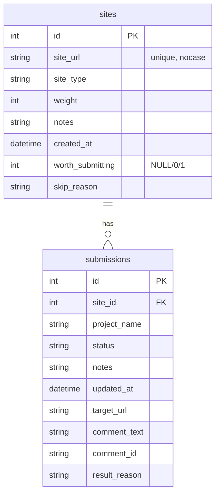

# Backlink 提交管理数据库

最后更新：2026-06-16

## 当前 Schema



## 关系规则

1. 一个站点可以被多个项目提交。
2. 一个项目对一个站点只有一条提交记录：`UNIQUE(site_id, project_name)`。
3. 删除站点时级联删除提交记录：`ON DELETE CASCADE`。
4. `sites.site_url` 大小写不敏感去重。

## 状态约束

`submissions.status` 只允许：

| 状态 | 用途 |
|------|------|
| 已提交 | 已确认提交成功或进入审核 |
| 待确认 | 表单已提交，但页面没有明确成功信号 |
| 失败 | 本次尝试失败，查看 notes/result_reason |
| 需付费 | 站点要求付费提交 |
| 需登录 | 站点要求登录 |
| 需验证码 | 站点有验证码，需人工处理 |
| 已失效 | 页面不可访问、404、证书错误、长期超时 |
| 跳过 | 不适合提交 |

## 字段使用规则

- `sites.worth_submitting`: `NULL` 未评估，`1` 值得提交，`0` 不值得提交。
- `sites.skip_reason`: 当 `worth_submitting=0` 时必须写明原因。
- `submissions.target_url`: 本次提交的具体页面 URL，博客评论通常是文章页。
- `submissions.comment_text`: 实际提交的评论正文。
- `submissions.comment_id`: 成功后能拿到评论 ID 时填写。
- `submissions.result_reason`: 成功识别方式或失败原因，例如 `success_text: awaiting moderation`、`找不到评论表单`。
- `submissions.notes`: 人工备注，适合写额外上下文。

## 常用查询

```sql
-- 查看 extractkeywords.com 还没处理的 blog_comment
SELECT s.id, s.site_url, s.worth_submitting, s.skip_reason
FROM sites s
LEFT JOIN submissions sb
  ON s.id = sb.site_id AND sb.project_name = 'extractkeywords.com'
WHERE s.site_type = 'blog_comment' AND sb.id IS NULL
ORDER BY s.weight DESC NULLS LAST
LIMIT 10;

-- 查看失败和待确认记录，优先复盘
SELECT s.id, s.site_url, sb.project_name, sb.status, sb.result_reason, sb.notes
FROM submissions sb
JOIN sites s ON s.id = sb.site_id
WHERE sb.status IN ('失败', '待确认', '需验证码')
ORDER BY sb.updated_at DESC;

-- 查看 worth=0 但没有 skip_reason 的站点
SELECT id, site_url
FROM sites
WHERE worth_submitting = 0
  AND (skip_reason IS NULL OR skip_reason = '');
```
